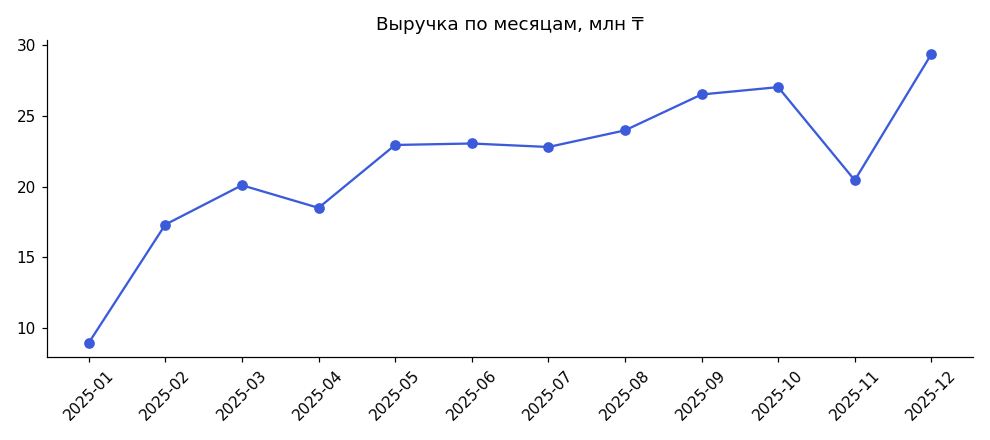
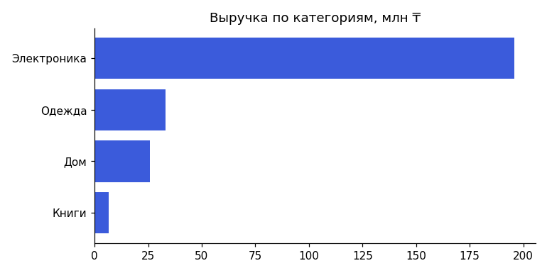
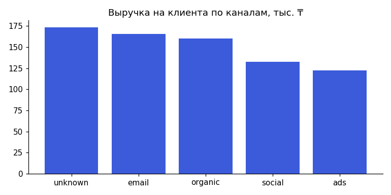
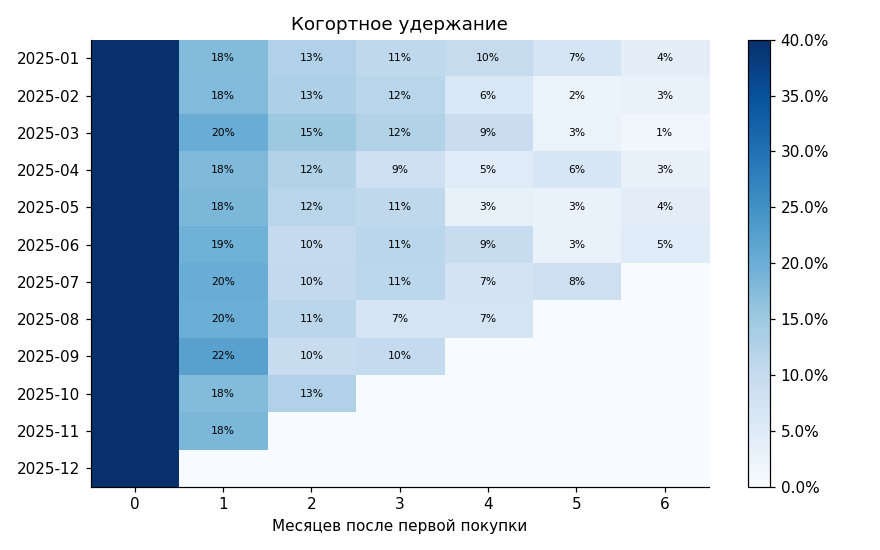

# Анализ продаж интернет-магазина за 2025 год

## Бизнес-вопрос
Откуда приходит выручка, какие клиенты возвращаются и куда направить маркетинговый бюджет в 2026 году?

## Ключевые метрики (только доставленные заказы)
| Метрика | Значение |
|---|---|
| Выручка | 260 975 200 ₸ |
| Заказов | 2,871 |
| Покупателей | 1,808 |
| Средний чек (AOV) | 90 900 ₸ |
| Доля повторных покупателей | 37.0% |
| Доля отмен и возвратов | 12.1% |

## 1. Динамика


Пик выручки — **2025-12**. Рост в ноябре–декабре связан с сезоном распродаж: на этот период нужно заранее закупать товар и планировать бюджет.

## 2. Категории


**Электроника** дает 75% выручки. Высокая зависимость от одной категории — риск, стоит развивать кросс-продажи (аксессуары к электронике).

## 3. Каналы привлечения
| Канал | Клиентов | Выручка на клиента | Доля повторных |
|---|---|---|---|
| unknown | 35 | 173 306 ₸ | 48.6% |
| email | 286 | 165 343 ₸ | 48.6% |
| organic | 577 | 160 069 ₸ | 46.3% |
| social | 371 | 132 540 ₸ | 30.2% |
| ads | 539 | 122 615 ₸ | 24.9% |



Лучший канал по выручке на клиента — **email**, худший — **ads**. Нужно сравнить с затратами на привлечение (CAC) и перераспределить бюджет в пользу каналов с максимальным LTV/CAC.

## 4. Удержание (когорты)


В среднем только **17%** клиентов возвращаются в следующем месяце после первой покупки. Главная точка роста — второй заказ.

## 5. RFM-сегментация
| Сегмент | Клиентов | Выручка | Заказов/клиент | Доля выручки |
|---|---|---|---|---|
| Под угрозой ухода | 262 | 63 971 850 ₸ | 1.9 | 24.5% |
| Лояльные | 263 | 61 726 600 ₸ | 2.6 | 23.7% |
| Чемпионы | 225 | 59 127 200 ₸ | 2.8 | 22.7% |
| Спящие | 700 | 45 092 250 ₸ | 1.0 | 17.3% |
| Новые | 358 | 31 057 300 ₸ | 1.0 | 11.9% |

Сегмент «Под угрозой ухода»: **262** клиентов, которые принесли 63 971 850 ₸. Им стоит отправить реактивационную кампанию.
Список клиентов с сегментами: `reports/rfm_segments.csv`.

## Рекомендации
1. Запустить welcome-цепочку писем с промокодом на второй заказ в течение 30 дней — это напрямую повышает удержание.
2. Перераспределить бюджет из **ads** в **email** и organic после расчета CAC.
3. Реактивационная кампания для сегмента «Под угрозой ухода».
4. Подготовить склад и рекламу к ноябрю–декабрю.

## Качество данных
```
Города: 22 вариантов написания -> 5
Канал привлечения: 40 пропусков заполнено значением 'unknown'
Заказы: удалено 30 полных дубликатов
Даты: приведены форматы YYYY-MM-DD и DD.MM.YYYY к единому
Цены: 100 значений-строк с пробелами преобразованы в числа
Количество: удалено 17 строк с quantity <= 0
```

## Ограничения
- Нет данных о затратах на маркетинг — нельзя посчитать CAC и ROMI.
- Один год данных — годовая сезонность оценена по одному циклу.
